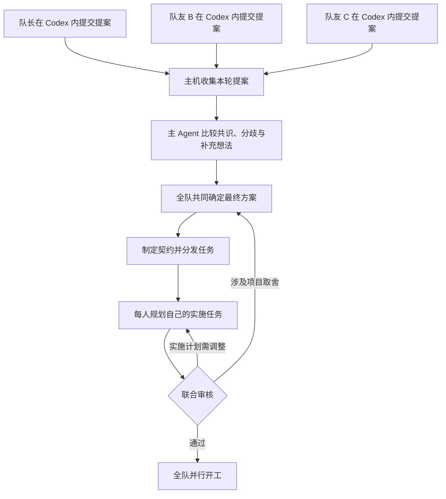

**AgentGit：原生 Codex 协作插件开发计划**

版本：v0.4｜更新日期：2026-09-21｜项目名暂定，发布前检查名称和包名可用性。

产品入口确定为 Codex 内的协作插件。成员使用自己的 Codex Plan 生成项目提案，在同一会话内确认并提交；全队确定总方案后，也在 Codex 内领取任务、读取契约、生成实施计划和回传审核。成员不需要下载、复制或上传计划文件。队长电脑负责协调，Cloudflare 临时隧道负责连接，共享房间用于全队比较与定案。

前期自由讨论不记录。讨论结束后，每个人（包括队长）先整理对整个项目的理解和想法；主 Agent 汇总已提交提案，全队确定最终方案后才制定契约、分发任务。领任务后的第二次 Plan 回答自己的任务如何实施，联合审核通过后全队并行开发。

本文件是拟实施规格，尚未实现或在你们设备上实测。本版取消 v0.3 中“先导出文件再导入、以后接原生提交”的实施路线，把插件、MCP 提交与任务回传放到首轮验收。录音、转写、会议导入和讨论过程记录继续排除。官方能力核查不等于本项目已通过集成测试。

**1. 产品从每个人主动提交提案开始**

前期讨论由大家使用面对面或已有沟通方式完成。产品不参与、不采集、不建立讨论日志，也不要求把讨论逐字复述给它。每个人在讨论结束后，用自己的语言告诉自己的 Codex：“我理解我们要做的是……，我想到的方案是……，我还不确定的是……”，并在 Plan 模式下整理。

第一轮每个人都可以考虑整个项目。此时还未分配正式任务，不能预先把 A 限定为前端、B 限定为后端，导致某些想法没有机会进入团队决策。个人偏好可以作为后续分工参考。

| 阶段 | 输入 | 输出 | 谁做决定 |
|---|---|---|---|
| 各自构思 | 成员对讨论的理解与补充想法 | 个人项目提案 TeamProposal | 成员本人确认后提交 |
| 汇总比较 | 本轮各人的已提交提案 | 共识候选、差异、互斥选项、待决问题 | 主 Agent 提供分析 |
| 团队定案 | 比较结果、补充问答、候选总方案 | 确认的 TeamPlanRevision | 全队共同决定 |
| 分工与契约 | 已确认总方案、仓库基线、成员偏好 | Task Package 与 ContractBundle | 主 Agent 拟定，Host 校验 |
| 个人实施规划 | 本人任务与统一契约 | TaskPlanRevision | 本人与自己的 Codex |
| 联合审核 | 全体实施计划的版本集合 | 审查结果与开工许可 | 主 Agent + 规则检查 |
| 并行开发 | 审定计划与契约 | 代码与测试成果 | 各成员独立执行 |

“个人项目提案”和“任务实施计划”是两个不同对象。前者回答要做什么，后者回答分工后这一块怎么做。界面、数据库和提示词都要把它们区分开。

系统只保存成员明确提交的提案、定案时明确提交的选择与结论、最终方案、任务、契约和开发证据；不自动上传个人 Codex 的完整聊天、探索过程或其他本地文件。

**2. Codex 原生集成：成员怎样实际操作**

产品由 AgentGit 插件、本地后台桥接程序、队长 Host 三部分组成。插件进入成员已有的 Codex 使用流程；后台程序处理连接和消息，不要求成员另开一个应用来搬运计划。官方插件机制支持组合 Skills、MCP 工具和 Hooks，适合作为这层入口。[Codex 插件文档](https://learn.chatgpt.com/docs/plugins)

**成员体验与能力边界**

下面是拟实现的交互，不是现在已经存在的 AgentGit 功能。技能名为暂定名称，安装后可以显式选择技能，也可以用自然语言表达操作。原生 `/plan` 与插件自定义技能是两类入口；不虚构 Codex 已内置 `/team` 等命令。

| 时刻 | 成员在 Codex 中做什么 | 插件与主机完成什么 |
|---|---|---|
| 首次加入 | 安装插件；说“加入这个房间”并提供邀请 | 配对身份，记住房间、项目和本机会话绑定 |
| 讨论后整理 | 用原生 Plan 入口说明自己的理解 | Codex 规划，插件技能约定提案格式，内容仍在本人会话 |
| 提交项目提案 | 检查待提交正文，说“提交这份提案” | MCP 工具发送确认的产物，返回提案编号与版本 |
| 全队定案 | 说“查看共同方案”“选择 B”“确认当前版本” | 读取主机问题并提交带版本的选择；也可使用共享房间 |
| 领取任务 | 说“领取我的任务” | 自动读取本人任务、团队方案、契约和审核要求作为工具结果 |
| 规划自己的任务 | 用原生 Plan 入口继续规划 | Codex 基于已取得的任务包生成 TaskPlan |
| 回传审核 | 说“提交实施计划审核” | 发送确认的 TaskPlan，审核意见回到本人收件箱 |
| 开始实现 | 在许可就绪后说“按审定计划开始” | 再核对版本与开工许可，按本机原生权限和模式流程执行 |

CLI 可用 `/skills` 或 `$技能名` 显式调用技能；原生 `/plan` 可切换规划模式。说“进入 Plan”本身不证明运行时已切换模式，实际状态必须通过支持的原生入口确认。[Skills 文档](https://learn.chatgpt.com/docs/build-skills)、[Codex 命令文档](https://learn.chatgpt.com/docs/developer-commands?surface=cli)

**各层的分工**

| 组件 | 本项目职责 |
|---|---|
| Skills | 识别当前处于项目提案、团队决策、任务规划还是执行阶段；告诉 Codex 调用哪个工具 |
| 本地 stdio MCP Bridge | 提供提交提案、读取任务、确认方案、回传计划、查看审核等具体工具 |
| Local Relay | 管理房间凭据、会话绑定、后台连接、Inbox/Outbox、断线重试；通过本地 IPC 服务各会话 |
| Hooks | 在支持的会话生命周期点提示有待处理事件，下一轮由 Codex 读取具体内容 |
| Host + Coordinator | 主机保存权威版本；受管理的主 Agent 会话自动汇总、拟定契约和联合审核 |
| 共享房间 Web | 多人共同查看比较结果和决策状态，不承担个人计划文件的搬运 |

MCP Bridge 由本机 Codex 启动，连接本机 Relay；Relay 经 CF 隧道调用 Host 的短 HTTP 请求并接收 WSS 事件。队友机器无需额外开公网入口。MCP 提供的是工具能力，不会自动得到任意聊天全文。[Codex MCP 文档](https://learn.chatgpt.com/docs/extend/mcp?surface=cli)

下文的“成员客户端”指插件、Bridge 与 Relay 的组合，不另设需要用户操作的个人计划编辑器。Relay 的收件提示可用本机通知；能否在空闲的 Codex 界面直接显示，由目标端能力决定。

**计划正文究竟怎么进入提交工具**

普通插件路径由当前 Codex 将要提交的正文放入 MCP 工具参数，不要求人复制。插件不能仅凭“安装了 MCP”就自动读到所有原生 Plan 产物。拟实现两个动作：

1. `agentgit_prepare_submission`：在允许该操作的原生模式下，将本次要共享的正文和类型冻结成本地 PendingSubmission，返回可读预览、submission_id 和 content_hash。只处理明确准备提交的产物，不扫描历史聊天。该操作会保存本地状态，不能标成无副作用读取。
2. `agentgit_submit_proposal` 或 `agentgit_submit_task_plan`：用户确认后，按 submission_id + content_hash 提交已冻结正文；工具从本地对象读取字节，不再让模型重新生成一遍内容。确认若已针对同一个冻结版本，不重复追问。

MCP 返回主机回执后，Codex 显示“提案 P-03，第 2 版已提交”等状态。发送超时只能显示待确认，并按幂等键查询；不能编造已提交。正文变动会生成新预览和新版本，旧确认不能套用。上下文压缩或内容过长导致无法完整重建时，在 Codex 内重新呈现待提交稿，不能悄悄截断。

这条路径的权威对象是本人看过的冻结提案，而不是未经验证的“原生 Plan 原始字节”。如目标版本提供可定位的官方产物接口，可验证后直接引用；不读取不稳定的 transcript 文件，不把 Stop 事件的最后一条普通消息默认认作完整 Plan。

对于 Host 自己管理的 Coordinator 会话，Adapter 可以监听完成的 plan item，自动固定其正文并生成候选方案；这不代表同一 Adapter 能接管任意已经打开的成员会话。[Codex App Server 文档](https://learn.chatgpt.com/docs/app-server)

**Plan 模式与提交动作分别验证**

生成计划和发布到团队是不同操作。现有官方文档没有保证所有运行端、权限策略都允许在 Plan 模式内执行这些写入工具。M0 必须验证本地准备和对外提交分别是否可用，不能通过把写工具标成 read-only、改写模式指令或 Hook 绕过限制。

如果目标版本要求先结束规划，则在原会话使用原生模式切换后执行“准备／提交”，保持项目代码不变；不增加文件下载上传步骤。也不能把 Codex 的“实施此计划”当成“提交给队长”。任务审核未通过时，提交动作不赋予代码执行许可。

**任务怎样回来，以及自动化到什么程度**

Host 把任务与审核意见按成员身份写入 Inbox。Relay 在线时自动接收，Codex 下次通过技能调用即可读到。拟用 SessionStart 和 UserPromptSubmit Hooks 提供固定格式的待办编号、类型和版本提示，再由 MCP 返回正文。Hook 不传出用户输入或聊天内容，也不把远端自由文本拼成高优先级指令。[Hooks 文档](https://learn.chatgpt.com/docs/hooks)

| 状态 | 能承诺的行为 |
|---|---|
| Relay 在线，Codex 空闲 | 任务自动送达本地；提示待处理，等待下一轮原生交互 |
| 用户继续提问或恢复会话 | 已启用的 Hook 提示待办，技能读取对应任务或审核意见 |
| Hooks 不可用或未启用 | 在 Codex 中说“同步团队状态”即可读取，不要求上传下载 |
| 成员正在执行代码 | 更新先进入收件箱；不能承诺普通插件立即中断已运行命令 |
| 本项目管理的 Coordinator | Host 通过 App Server 排队发起下一轮、处理问题和最终输出 |

本版不把“网络收到任务”标成“Codex 已读取”或“已经开工”。三个状态分别记录。普通插件的生命周期回调也不等于任意时刻唤醒空闲会话。后续如需成员无人值守自动开新轮次，单独验证受管理执行会话及其原生展示方式，不作为现成插件能力承诺。

**支持范围与首轮验证**

| 运行端 | 本版路线 |
|---|---|
| Codex CLI | 首个真实验证目标：插件 + 本地 MCP + Relay；Hooks 按实际启用情况验证 |
| 桌面端的本地 Codex | 同一插件路线；需核对执行环境能否启动本地程序、Plan 行为及 Hooks，再宣布支持 |
| Codex IDE 扩展 | 当前官方文档说明不支持插件包；可另行接入 Skills + MCP，列为适配项 |
| 纯网页或远程执行环境 | 不默认能运行成员电脑上的 stdio 程序；当前不列入本机连接方案的支持承诺 |

插件支持范围与本地 MCP 能力以官方说明及目标版本实测为准。自定义按钮、嵌入式卡片和侧栏均不是基础闭环的前提，不能把网页工具 UI 支持推断为所有 Codex 端都可修改原生 Plan 界面。[插件支持范围](https://learn.chatgpt.com/docs/plugins)、[MCP 配置](https://learn.chatgpt.com/docs/extend/mcp?surface=cli)

**3. 部署方式：全部协作服务运行在队长电脑**

| 所在位置 | 组件 | 职责 |
|---|---|---|
| 队长电脑 | Room Host | 房间、成员、问答汇总、版本、任务、审核、开工和事件 |
| 队长电脑 | SQLite + 本地文件 | 已提交提案、方案、任务、契约和事件 |
| 队长电脑 | Coordinator Codex 会话 | 提案比较、候选总方案、任务契约、联合审核和变更分析 |
| 队长电脑 | Captain Worker Codex 会话 | 队长自己的项目提案，以及领任务后的规划和开发 |
| 所有成员电脑 | Codex 插件 + 本地 MCP Bridge / Relay | 在原生会话中提交提案、接任务、读取契约、回传计划与审核结果 |
| Cloudflare | 临时隧道 | 转发成员连接到队长电脑的房间入口 |
| 已有 Git remote（如团队原本使用） | 代码版本同步 | 推送分支、交换 commit，不承担房间状态 |

无需另租应用服务器或数据库。Codex 仍使用各成员已有的运行环境与身份。本地 Relay 随插件配套程序安装，不增加一台远程服务器，也不要求另一个计划编辑器。若团队已有 GitHub/GitLab 仓库，可以继续使用，不因此增加自托管服务。

SQLite 只由队长主机上的 Host 进程读写，队友经业务接口访问。采用本地 WAL 和短事务，不能把数据库放进多人共享网络目录直接打开。SQLite 官方对 WAL 的同主机限制有明确说明。[SQLite WAL 文档](https://www.sqlite.org/wal.html)

**4. 队长同时承担协调与开发的方式**

队长电脑里保留两个独立会话：

| 会话 | 代码环境 | 可以做什么 |
|---|---|---|
| 主 Agent / Coordinator | 固定基线的只读仓库视图 | 比较已提交提案、发起澄清、生成候选方案、评审实施计划、提出契约变更 |
| 队长 Worker | 自己任务的独立 worktree | 与其他成员相同，先提交项目提案，领任务后再规划、申请开工、实施和提交成果 |

两者分开 thread、输入队列和任务身份，防止队长执行任务时主 Agent 的上下文混入局部实现。协调会话输出的任务和契约由 Host 验证后保存；主 Agent 无须拥有任意改写所有人的代码权限。

队长第一轮也提交自己的项目提案。主 Agent 不能把队长个人意见默认视为全队决定；队长 Worker 后续也必须提交实施计划并通过联合审核，不因运行在主机上跳过关口。三个成员使用自己的执行会话和身份；主 Agent 不需要在队长电脑上代替全队运行三个开发 Worker。

首版按“Host 在事件发生时驱动受管理协调会话，个人 Worker 在原生 Codex 中按任务与许可工作”调度。成员 Worker 的普通插件接入不保证空闲时自动启动下一轮。需要实测队长账户的并发与额度情况，不能预设无限会话容量。

**5. Cloudflare 隧道和通信要怎么改**

队长主机只将房间 Web/API/事件入口开放给隧道，例如本地 4399 端口。手动验证阶段可以使用：

```bash
cloudflared tunnel --url http://localhost:4399
```

Quick Tunnel 会生成临时地址，官方明确不支持 SSE，也不承诺可用性 SLA。因此本版使用 WSS 传输团队事件、HTTP 返回短请求结果；保留基于游标的轮询恢复，临时地址变化后允许成员重新连接同一房间。[Cloudflare Quick Tunnels 文档](https://developers.cloudflare.com/cloudflare-one/networks/connectors/cloudflare-tunnel/do-more-with-tunnels/trycloudflare/)

Cloudflare 的 WebSocket 连接也可能因网络维护而断开，需要心跳、重连和状态补收。[Cloudflare WebSocket 文档](https://developers.cloudflare.com/network/websockets/)

| 通道 | 首版实现 |
|---|---|
| 浏览器查看房间 | 队长 Host 提供网页，经隧道访问 |
| 浏览器提交选项、确认计划 | HTTP 短请求，带成员身份和预期版本 |
| 所有成员收到状态 | WSS；不可用时 HTTP 按游标获取事件 |
| 队友客户端接收任务 | 主动连队长 Host，无须给每个队友再开隧道 |
| 长时间提案汇总、规划、审核 | HTTP 创建 job 后立即返回 ID，事件/轮询查看进展 |
| Codex 调用房间工具 | 每台电脑运行本地 stdio MCP Bridge，再转为 Host 的 HTTP 请求 |
| 成员原生 Codex 接入 | Skills + 本地 MCP；支持时用 Hooks 提示事件 |
| Host 控制主 Agent | 本机 App Server stdio，仅调度本项目管理的 Coordinator |

使用本地 MCP Bridge 可以避免把依赖 SSE 的远程 MCP 连接直接塞进 Quick Tunnel。MCP 工具调用保持短小，长任务返回 job_id，Agent 后续查询。原生远程 Streamable HTTP MCP 不作为临时隧道路径的前提。

隧道只暴露业务入口，不暴露原始 Codex RPC、任意 shell、数据库或整个文件系统。邀请链接用于交换房间身份；成员后续使用独立、可撤销的会话凭据。临时网址本身不充当鉴权方式。

成员的两轮 Plan 均在自己的原生 Codex 中完成。通过插件提交选定产物，主机返回带版本的回执。分工后，任务先到已配对成员的 Relay 收件箱，再由 Codex 的任务技能读取；共享页面可显示状态，但不成为个人提交或领任务的必经入口。不要让远程网页直接跨域调用任意 localhost 服务。

**6. 从个人构思到共同定案，再到开工**



图从个人提案开始，先前自由讨论不进入系统状态或记录。

| 阶段 | 进入条件 | 退出条件 |
|---|---|---|
| PROPOSALS_OPEN | 房间建立并确定本轮参与成员 | 所需成员各自提交提案，或明确表示无新增提案 |
| SYNTHESIZING | 固定 ProposalSet，记录每份提案版本 | 生成来源可追踪的比较结果与候选方案 |
| TEAM_DECIDING | 全队能看到相同候选版本 | 处理关键分歧并确认同一版最终方案 |
| TEAM_CONFIRMED | 本轮确认条件满足 | 允许生成正式任务和契约 |
| CONTRACTING | 总方案已确认 | 结构化任务与契约检查通过后分发 |
| TASK_PLANNING | 成员收到任务包 | 各自提交实施计划或指出阻塞 |
| CROSS_REVIEW | 实施计划齐备 | 联合审核通过或定向退回修改 |
| READY | 审核集合与当前版本匹配 | 本轮客户端确认环境和任务包就绪 |
| RUNNING | Host 发布开工许可 | 产生集成候选或需重新规划 |
| INTEGRATING | 候选成果齐备 | 契约与集成检查通过 |

提案提交不等于总方案确认，总方案确认不等于已经允许改代码。三个阶段分别有明确入口，不能通过“主 Agent 已经总结完”自动跳过全队定案。

**7. 团队定案阶段的共享 Plan 问答**

官方 App Server 文档包含 collaborationMode、结构化用户输入请求，以及 Plan 输出事件；部分相关能力标为实验性。实现要使用目标 Codex 版本生成的类型并实测。最终方案应以完成的 plan item 为依据，不能把 turn/plan/updated 的步骤状态列表当成完整方案。[Codex App Server 文档](https://learn.chatgpt.com/docs/app-server)

各人的第一轮 Plan 问答使用本人原生 Codex 界面。需要全队共同回答的问题，来自主 Agent 汇总提案后的定案阶段。本项目的 Question Broker 在这个阶段提供共享界面：

1. Coordinator 在收到本轮提案集合后开始真实 Plan 轮次，比较提案、必要时探索仓库，再提出需要共同决定的问题。
2. Adapter 接到结构化提问，Host 生成 Question 卡片，保存来源会话、轮次、请求 ID、问题版本、选项和补充输入入口。
3. 共享页面显示同一问题；各成员也能在 Codex 中通过房间技能读取问题、提交选择及理由。两种入口写入同一个 Question 版本，其他人能看到明确提交的意见。
4. Host 汇总意见。建议规则为：每人先提交意见或明确弃权，队长再提交统一答复；有实质分歧时继续讨论或让主 Agent解释取舍。
5. 对该原生请求只提交一份结构正确的答复。全队明确提交的选项与理由进入决策记录；自由讨论过程不采集。不能把三次投票分别回给同一个 RPC 请求。
6. 主 Agent 继续规划；新问题继续广播，最终方案流式展示并在完成时固定版本。

问题选项属于产品决策，不是“谁先点谁决定”。投票和最终答复是不同对象。默认不采用超时就代表同意；成员离开时先显式调整参与名单或弃权。

问题键包含 app_server_session、thread、turn、request_id；只用数字 request_id 可能在不同会话发生碰撞。Host 用版本比较防止两次最终提交。出站回执持久化，重启后若请求状态未知，先核对；不能声称网络发送严格只执行一次。

原生请求可能超时、结束或被清理。如果请求已失效，保留成员意见并标记该题关闭，统一结论作为后续轮次输入；不继续回复旧 ID。不同步的浏览器或插件要先取得当前问题版本再提交。

原生 Plan 不保证每次都会生成选择题。若信息已足够，可以直接出方案；确实还有重要未决事项时，再请求澄清。应用自行生成的确认卡与 Codex 原生提问分开标注，不伪装成原生行为。

执行权限请求仍交给对应成员的本地界面处理，不拿团队投票代替文件或命令权限授权。

**8. 总方案确认与主 Agent 制定协作契约**

候选总方案必须标明 ProposalSet、来源提案版本，以及哪些主张被采纳、修改、暂缓或仍有争议。只出现一次的想法也要可见，不能被自动当成噪声删除。

全员确认的是具体的 TeamPlanRevision。内容变化就生成新版本；旧版的确认不能自动沿用到新版。队长在这里提交集体决定，而日常技术检查不需要反复叫全队点确认。

确认后的主 Agent 拿到：团队方案、已明确提交的团队决定、仓库基线、成员能力和偏好、可用时间、已有约束。它产生一个 BatchProposal，包含所有成员的任务和统一契约。

| Task Package 字段 | 意义 |
|---|---|
| task_id / owner | 明确分给哪个成员，队长也有自己的任务 |
| goal / acceptance | 结果和验收标准 |
| team_plan_hash | 基于哪一份共同确认的方案 |
| contract_bundle_hash | 必须遵守的协作契约集合 |
| repo_base_sha | 共同规划的代码基线 |
| write_scope / shared_resources | 允许修改的范围与受管公共资源 |
| provides / consumes | 提供什么接口，依赖哪些接口 |
| dependency_kind | 契约依赖、真实实现依赖或集成依赖 |
| mock / fixtures | 上游没完成时下游如何先做 |
| local_plan_schema | 个人 Plan 必须返回哪些信息 |
| test_commands / evidence | 怎样证明该任务完成 |

契约至少覆盖六类边界：

| 契约 | 例子 | 检查方式 |
|---|---|---|
| API / 消息 | 路径、字段、错误码、流式事件 | schema 校验和契约测试 |
| 代码类型 / 导出 | 共用类型、函数签名、组件输入 | 类型检查、固定示例 |
| 数据与迁移 | 谁改哪张表，迁移执行顺序 | 所有权和迁移顺序检查 |
| 文件与共享入口 | 路由入口、根依赖、共享配置 | 写范围交集与负责人规则 |
| 开发运行资源 | 端口、数据库 schema、测试账号 | 独立实例或命名空间配置 |
| 集成与验收 | mock 替换、跨模块流程、提交形式 | 集成用例和固定 commit 检查 |

数据库/端口等也要分开，只有 worktree 隔离无法避免两个任务同时改同一个开发数据库。

首次全队开工前，需要一个共同的基础骨架：目录、依赖、入口接口、测试命令。已有项目直接固定基线；新项目安排有明确负责人和时间盒的 setup 任务先完成最小基线，其他人可先读方案、校对契约和准备样例。不能假设从空目录开始的三个 Agent 会自然选择兼容的框架和项目结构。

任务和契约在 Host 中有结构化权威版本。仓库文件是带 hash 的快照。主 Agent 输出先经过 schema 验证和冲突检查，不能把自然语言“应该没问题”直接转成已审定状态。

若分工引入了新的产品取舍或改变已确认范围，回到团队方案确认；纯技术拆分可在已授权范围内继续，避免每个字段都召集全员。

**9. 个人项目提案如何提交与汇总**

成员与自己的 Codex Plan 交流，整理 TeamProposal，并在原会话内查看提交预览和修改。提案采用轻量字段与 Markdown 正文，先保证表达轻便，不要求每人写一份长篇 PRD。插件负责组织工具参数，成员不编辑 JSON，也不搬运计划文件。

| 提案内容 | 例子 |
|---|---|
| 我理解的目标 | 让黑客松成员都能同时推进自己的工作 |
| 必须满足的条件 | 使用各自 Codex；队长本机主持 |
| 建议的用户流程 | 各自提案，集中定案，再分工 |
| 关键功能与优先级 | 提案对比优先，精美看板可后做 |
| 建议的技术路线与理由 | 临时隧道、独立工作区、契约驱动 |
| 我认为尚未决定的事 | 是否允许队长最终裁决，如何处理缺席 |
| 额外想法与备选方案 | 某个成员新想到的功能或不同实现路径 |
| 个人偏好 | 愿意承担哪类工作，仅供以后分配参考 |

每项可标记为“我理解已达成一致”“我的建议”“我的疑问”。前一标签只是提交者的理解，不是会议事实，更不是全队已批准。系统没有讨论原始记录，不应凭空判断谁记错了；矛盾要交给成员澄清。

提交协议至少包括 proposal_id、author_id、revision、content_hash、body、submission_id、idempotency_key 和 submitted_at；主机从鉴权身份确定作者，不信任模型自报 author_id。成员在 Codex 内确认“提交提案”后，Bridge 仅发送这份冻结产物，重复请求返回同一回执。主机显示已提交/待提交状态；“无新增提案”需要成员明确选择，不能把离线当作赞同。

汇总建议分两步：

1. 比较：提取主张，合并语义相同的表达，保留来源；标出共识候选、互相补充、直接矛盾、独有建议和缺失信息。
2. 起草：按比较结果形成候选总方案。未定事项保持未定，或给出清楚标记的推荐选项，交由全队选择。

例如三人提案分别为：

| 成员 | 已提交的理解或建议 |
|---|---|
| A | 第一版不做登录，方便演示 |
| B | 需要邀请加入，不能任意人进入 |
| C | 需要用户账号和登录页面 |

主 Agent 应指出：邀请加入与账号登录是两类方案，A 与 B 可能并不冲突；C 增加了账号体系。它可以建议“第一版邀请码入房，后续再考虑账号”，但必须作为候选决策展示，不能直接写成“大家一致同意”。

每条整合后的决定能查看来源和处理状态：采纳、合并、修改、暂缓、未决；暂缓或舍弃时附简短理由。少数成员的独有想法不会因为票数少自动消失。

ProposalSet 固定各人的提案版本与输入集合 hash。汇总期间出现新提案或修订，先显示“有新输入”，由主机开启下一版汇总；不能偷偷改变正在确认的方案。最终 TeamPlanRevision 绑定所用 ProposalSet，任何新引入的实质取舍都重新展示。

多人同时提出修订时用预期版本校验，避免后提交者覆盖前一人的决定。系统保存明确提交的修订、选项和最终结论，不建立自由讨论的逐句聊天记录。

**10. 领任务后的第二次 Plan：实施计划**

这一轮回答“我负责的任务怎么实现”，与前面表达整个项目理解的 TeamProposal 分开。已选定方向和有用的个人提案内容可以复用，不要求成员重复叙述。

成员在原生 Codex 中调用任务技能，MCP 自动取回 Task Package；Relay 校验仓库和契约版本，配套工作区工具创建或选择独立 worktree。切换工作区通过目标端支持的原生方式完成，不能仅改会话里的路径文字。随后使用原生 Plan 入口规划，项目代码保持只读；在运行策略允许时，插件可在自己的状态区保存待提交产物。

实施 Plan 的上下文包含本人任务、确认后的团队方案、目标验收、受影响的契约、公共决策摘要、代码基线与可用 Mock。第一轮个人建议若未被采纳，不能悄悄作为本轮实现目标。对其他成员只提供必要的接口和依赖信息，不复制整个团队的私人会话。

| TaskPlan 字段 | 要求 |
|---|---|
| source_task_hash / contract_hashes | 精确指出依据的任务和契约版本 |
| repo_base_sha / workspace_fingerprint | 代码基线与本地未提交改动的声明 |
| steps | 可执行步骤，区分设计、实现、测试 |
| planned_changes | 文件/目录/导出/配置/迁移的预期修改范围 |
| provides / consumes | 使用的接口和版本 |
| startup_dependencies | 现在即可开始与必须等待的部分 |
| mock_strategy | 依赖未实现时的开发方式 |
| tests | 契约、单任务和集成测试方案 |
| risks / open_questions | 明确未决事项，不能藏在“之后再处理”里 |
| contract_change_requests | 现有契约不足时，单独提出修订请求 |

本人可以与自己的 Codex 继续问答，完善计划。完成后在同一会话说“提交实施计划审核”，插件发送预览并确认的 TaskPlan 和可读摘要，主机记录 hash、修订号和来源。个人修订产生新版本，不覆盖已经评审的版本。

计划阶段的“不要改代码”同时由模式、只读执行策略和开始许可检查落实，不能只放在提示词里。实际可用沙箱选项按所用版本和平台验证；插件技能与 Hooks 不能代替运行时沙箱。Plan 模式本身不等于文件系统权限边界。若某端无法配置所需只读策略，不把它标成已验证的强制执行支持。

**11. 主 Agent 联合审核的规则**

审核输入是整个候选计划集合，而不是只看三份单独的通过结论。Host 首先执行确定性检查，再让 Coordinator 做可解释的技术审查。

| 检查项 | 怎样判断 | 处理结果 |
|---|---|---|
| 版本一致性 | 任务、契约、团队方案、基线 hash 匹配 | 不匹配直接退回同步 |
| 修改范围 | 检查 planned_changes 与 write_scope、其他计划交集 | 重叠资源必须指定单一负责人或顺序 |
| 接口兼容 | 提供方与消费方 schema/签名/行为约定一致 | 不一致退回有关双方 |
| 数据迁移 | 迁移所有者、版本和执行顺序明确 | 冲突需重分工 |
| 运行资源 | 端口、数据库、测试数据互不覆盖 | 提供隔离配置 |
| 可开工条件 | 依赖有已接受契约、Mock 或已完成实现 | 无法先开工则调整任务与依赖类型 |
| 依赖环 | 可执行任务图无未解决的互相等待 | 调整接口、引入 Mock 或分阶段 |
| 验收覆盖 | 所有团队需求至少有任务与测试承担 | 漏项补任务 |
| 实现合理性 | 主 Agent 比较假设、边界、复杂度和隐藏风险 | 给出理由与具体修改要求 |

评审状态使用：

| 状态 | 含义 | 后续 |
|---|---|---|
| APPROVED | 当前版本集合可进入准备阶段 | 等待客户端就绪 |
| CHANGES_REQUESTED | 某些个人计划要修改 | 定向回传修改点，仅相关成员重做 |
| CONTRACT_REVISION_REQUIRED | 同一契约本身不够或相互矛盾 | 主 Agent 提出新契约，受影响计划重新审核 |
| HUMAN_DECISION_REQUIRED | 涉及产品取舍或无法收敛的分歧 | 房间显示一个共同问题 |

“审核通过”意味着在当前可检查信息下允许尝试并行，并不是对所有实现永不冲突的保证。后续提交仍要做范围、契约和集成测试。

反馈与重审先限制最多两轮；仍不收敛时显示具体冲突，交由团队解决。原生插件路径由成员在 Codex 中读取意见并继续规划；只有已验证且授权的受管理会话才自动推进修订轮次，避免假设普通插件能持续唤醒成员 Agent。

例如：B 计划把 /chat 返回改为 content，C 的计划仍读取 answer。联合检查指出同一接口的字段假设不同；如果新契约已经定义 content，就只退回 C 的个人计划；如果契约本身还写 answer，就先进入契约修订，不能让 B 擅自改约定后要求 C 自动追随。

**12. 开工许可与“所有人同时开始”**

Host 为本轮审核建立 ApprovalSet，绑定：

- 团队方案 hash、契约集合 hash、公共基线 SHA。
- 每个人的 Task Package hash 与 TaskPlan hash。
- 规则检查版本、主 Agent 审查结果、所有必要决定。
- 房间 epoch 和本轮 batch_id。

随后每个客户端返回 Ready：已拿到对应契约、代码基线正确、工作区无未声明变化、Codex 可运行。初始批次默认全员就绪才发布 StartBatch，队长自己包含在内。

Host 在事务中保存 StartBatch 和事件。原生插件路径向各成员显示“已准许开工”，成员在 Codex 内发起执行时取得唯一 ExecutionLease；重复消息不重复领取。受管理会话才由其拥有者按明确授权自动发起执行。大家无需等待另一人实现完成即可并行，“同时开工”不要求普通插件远程强制切换模式或毫秒级同步。

执行技能在进入实现前再次检查所有 hash；实际模式切换使用目标端支持的入口。个人计划、契约或共同基线发生变化时，旧许可失效。重复收到开工事件不能启动第二个执行会话。部分成员离线时，显示缺席状态；若要先开一个独立子批次，需要明确调整批次，并重查其依赖。

允许操作由本地用户自己的运行政策决定，团队开工许可不能扩大 Codex 的命令、网络和文件权限。

**13. 开工后的通信、改需求与成果整合**

开发过程中保留 v0.1 的必要能力：任务存在感、契约变化通知、事件补收、固定 commit 成果、集成验证。

事件类型建议为 proposal.submitted、proposal.revised、synthesis.completed、question.opened、question.finalized、team_plan.confirmed、task.dispatched、task_plan.submitted、review.completed、contract.revised、batch.started、artifact.submitted。

房间业务状态和事件在同一 SQLite 事务提交，用 room_seq 排序。传输至少一次，客户端使用 event_id 去重。输出片段可以合并，最终计划、决定和审核结果必须持久化，不能只保存在 WebSocket 内存里。

需求变化时：

1. 成员在 Codex 内通过插件提出 Change Proposal，或在共享房间提交，并指出原因与目标。
2. 主 Agent 计算受影响的契约、任务、个人计划和执行许可。
3. 产品层变化需要相关团队决定；技术层变化按已确定规则处理。
4. Host 创建新版本，失效相关许可；已完成工作保留，未受影响任务继续。
5. 有关成员再次 Plan，说明保留、调整和新增部分。
6. 主 Agent 对变化后的组合重审，发布新批次或定向继续许可。

只有契约变化并不足以证明代码已适配。状态要区分“Relay 收到”“Codex 读取”“成员已响应”“代码验证通过”。契约失效后 Host 拒绝旧版本的新许可与成果接纳；普通插件不能保证立即终止已经运行的本地命令，成员在下一次协作检查点同步。可用 Hooks 只是补充，不能宣称构成完整执行边界。

成果提交必须带 commit_sha、contract_hashes、task_plan_hash 和测试证据。主机在独立集成工作区组合具体 commit，执行契约和集成检查；基线更新则重新检查相应组合。Git 没有文本冲突不代表接口兼容。

已有 Git remote 是默认代码通道。完全离线或不使用任何代码托管时，可后续支持经房间上传 Git bundle；这需要验证基线、对象完整性与引用范围，首版不额外搭建 Git 服务。

**14. 主机掉线、休眠与临时地址变化**

队长主机是房间唯一协调节点。它离线时，新的共同决策、评审、任务重分配和成果接纳暂停。正在做的本地工作保留；各客户端标记状态尚未同步，重新连接后先校验当前版本再提交或继续新步骤。

| 情况 | 处理方式 |
|---|---|
| 短暂断线 | 心跳发现，重连后根据 room_seq 补收 |
| CF 地址改变 | 队长分享新地址；成员在 Codex 内更新连接，Relay 沿用 room_id 并验证主机身份和已配对凭据 |
| 队长应用重启 | 从 SQLite 恢复方案、问题、任务和审查；不假设旧 RPC 请求仍在 |
| 原生 Plan 问题失效 | 保留意见，用恢复轮次重新提交共同结论 |
| 主机睡眠或关机 | 房间显示离线；保留个人工作，不擅自选出第二个队长 |
| 数据恢复 | 使用一致的 SQLite 备份及提案/方案文件清单恢复，不能只复制正在使用的主数据库文件 |
| 真正迁移主机 | 以后做显式导出/导入；旧主机停止，新 epoch 启动，避免双主 |

隧道进程随房间启动/关闭管理。若检测到用户已有 cloudflared 配置，不自动改名或覆盖；给出诊断并采用隔离的受支持启动方式，必要时让用户处理现有配置。临时域名是连接地址，房间身份不应绑定在域名上。

**15. 数据模型与代码模块**

| 数据对象 | 关键用途 |
|---|---|
| Room / Member / Device | 房间、参与者、本机配对、主机 epoch |
| SessionBinding | 原生会话到 room/member/repository/role/task 的本地绑定；避免跨项目、跨身份误投 |
| PendingSubmission / SubmissionReceipt | 本地冻结正文、确认的 hash、幂等键、主机回执与待确认状态 |
| TeamProposalRevision | 成员主动提交的项目理解、建议和疑问 |
| ProposalSet | 本轮汇总使用的所有提案版本 |
| Synthesis / ClaimMapping | 主张对比、来源映射、差异和处理状态 |
| Question / Vote / FinalAnswer | 定案阶段明确提交的问题、选择与统一答复 |
| TeamPlanRevision / Confirmation | 最终方案与该版本的全员确认 |
| TaskPackage / ContractBundle | 定案后生成的任务与协作边界 |
| TaskPlanRevision | 领任务后的具体实施计划 |
| Review / ApprovalSet | 跨任务计划审核证据与版本集合 |
| StartBatch / ExecutionLease | 哪些成员获准开始哪个版本 |
| Event / Inbox / Outbox / DeliveryAck | 持久化事件、重试、补收；分开记录送达与 Codex 读取 |
| Artifact / IntegrationResult | 实际代码与测试证据 |

建议使用 TypeScript workspace，职责划分如下：

| 路径 | 职责 |
|---|---|
| plugins/agentgit | 插件清单、Skills、MCP 配置和可选 Hooks；首轮必须可安装 |
| apps/host | 队长主机、房间服务、隧道生命周期、Coordinator 调度 |
| apps/relay | 成员本地后台程序、凭据、会话绑定、Inbox/Outbox、连接与恢复 |
| apps/web | 提案差异、共同定案和协作状态 |
| packages/mcp-bridge | Codex 内的提交、读取、确认、回传、查询等工具 |
| packages/protocol | 提案、方案、任务、事件、回执与版本格式 |
| packages/submissions | 待提交正文冻结、预览 hash、确认和幂等提交 |
| packages/codex-adapter | 仅管理本项目拥有的 App Server 会话、Plan 输出和问题回执 |
| packages/proposals | 提案版本集合、汇总结果与来源 |
| packages/planning | 团队定案、任务包、实施计划与联合审核 |
| packages/contracts | 契约、范围、依赖检查和 Mock |
| packages/store | Host SQLite 与 Relay 本地状态；各机器独立存储 |
| packages/git | 工作区、基线、commit 和候选集成 |
| examples | 三份不同提案、真实原生交互记录和跨任务冲突样例 |

插件打包采用官方支持的清单结构；新包使用根目录 plugin.json、mcp.json、skills/，OpenAI 专属配置放 extensions.com.openai。按目标版本需要提供兼容清单，并验证实际安装，不把仅有文件夹当成安装成功。[插件打包文档](https://developers.openai.com/plugins/build/plugins)

队长保存 host.db、proposals、team-plans、task-plans、contracts 和工作证据；成员本地只保存配对信息、主动准备提交的产物和收发状态。没有音频采集、转写任务或讨论记录表。凭据不进入模型工具输出；私人对话与未选定草稿不自动进入 Host。例子中的真实交互记录须经参与者明确选择，只保留验证所需的提交与回执，不采集日常讨论。

**16. 开发顺序：先证明原生 Codex 内能完成协作操作**

按三人各自配 Codex、已有基础环境，暂估 18～22 个工作日。原生集成进入第一阶段，前 3 天重点验证模式边界、正文保真、工具可用性和事件回传；根据真实版本结果修订工期。下表是估算，不是已验证交付承诺。

| 时间 | 里程碑 | 可检验交付物 |
|---|---|---|
| D1～D3 | M0 原生交互闭环 | 插件可安装；真实 Codex Plan 提案在原会话内提交到队长主机并收到回执；分配一个验证任务后在原会话内取回，无文件搬运 |
| D4～D6 | M1 三人提案与共同定案 | 三人原生提交、提案版本和来源比较、共同问答、方案确认与失效 |
| D7～D9 | M2 定案后分工与回传 | 总方案确认后制订契约、派发全队任务；各人读取任务、Plan、在 Codex 内提交实施计划 |
| D10～D13 | M3 联合审核与开工 | 审核意见送回原生收件箱、定向修改、版本绑定、三成员取得执行许可 |
| D14～D16 | M4 变更与成果集成 | 变化重审、固定 commit 成果、契约和集成检查 |
| D17～D22 | M5 恢复、端适配与试用 | 主机/Relay 重启、地址变化、重复提交、长计划、目标桌面端验证和全流程试用 |
| 后续 | M6 公开分发 | 安装升级体验、公开目录提交及其他运行端适配；不影响前期团队安装 |

M0 不允许用文件上传页面、手动粘贴到网页或假工具返回替代原生提交。Host 可以先做最小持久化和 fixture 任务，但提案必须来自真实 Codex Plan，并完整记录实际需要的原生模式切换步骤。用于验证领取动作的 fixture 任务明确标为测试数据，不代表团队已经定案或开始正式分工。

M0 的通过条件是：一个成员在 Codex 内完成加入 → Plan → 检查提交稿 → 提交 → 获得主机回执 → 读取验证任务。原生工具受模式限制时使用支持的切换方式，仍无人工文件搬运。没有真实 Codex 环境或不能确认完整正文时，报告未验证，不把协议单元测试当成产品闭环。

M1 演示使用三份有差异的真实提案，包含一个独有想法和一个未定取舍。验证主 Agent 确实呈现分歧与来源，全队在同一主机上的房间状态中定案；成员可通过共享页面或 Codex 工具提交明确选择。完成定案才进入正式任务分发。

首轮只有 48 小时时，以 M0 的核心原生提交和读取为目标，不宣称已完成自动分工、联合审核或任意原生会话自动唤醒。

**17. 三人开发分工**

| 成员 | 负责的完整结果 | 可独立运行的样例 |
|---|---|---|
| A | Host、提案版本、共同定案、事件与 Coordinator | 带幂等回执的提交、固定输入汇总与任务 Inbox |
| B | Codex 插件、Skills、MCP Bridge、Relay、Hooks 和运行端验证 | 一个成员完全在原生 Codex 内提交与领取任务 |
| C | 预览与版本核对、提案比较、契约和联合审核检查 | 长计划预览保真；不同提案可比较；矛盾任务计划可检出 |

D1 冻结 TeamProposal、PendingSubmission、SubmissionReceipt、ProposalSet、TaskPackage、TaskPlan 和事件 DTO。A 提供 Host fixture，B 先证明真实原生 Plan 到工具调用可行，C 并行验证冻结正文及比较规则。插件最小打包由 B 在 M0 完成，不能等所有 Web 页面结束后再补。

共享协议、根配置和依赖设轮值维护者。每人交付自己的测试与演示，集成责任按阶段轮值。Hooks 或桌面端能力不满足时，先保留原生 MCP 同步入口，不以自动接管任意会话或文件上传替代未经验证的能力。

**18. 可建立为 Issues 的工作项**

保留既有 P 编号便于追踪，v0.4 新增 P-025～P-028，并将原生接入移到最前。以下均为待实施任务，未创建外部 Issues。

| ID | 工作项 | 负责人 | 完成证据 |
|---|---|---|---|
| P-001 | 提案/方案/任务对象与 fixture | A，三人确认 | TeamProposal 与 TaskPlan 区分，增加提交回执和绑定格式 |
| P-025 | 最小插件、Skills 和 MCP 配置 | B | 新的真实 Codex 会话可识别技能并调用工具 |
| P-026 | Local Relay 与 SessionBinding | B+A | 正确绑定房间/成员/仓库/角色，不串任务 |
| P-002 | 原生 Plan 到提交工具的能力验证 | B+C | 正文可预览、模式行为有实测、无需人工导出导入 |
| P-003 | Host + Quick Tunnel + WSS | A | 跨设备访问、重连、HTTP 补收与提交回执 |
| P-004 | 待提交稿冻结与预览 | B+C | 长计划、修改和压缩后仍核对完整正文 |
| P-005 | 提案提交与修订 | A+B | 仅提交确认产物，超时重试不重复发布 |
| P-006 | 邀请与设备配对 | A+B | 在 Codex 内加入房间并记住连接身份 |
| P-027 | 原生收件箱、同步技能与 Hooks | B | 任务及审核意见能读取，送达与读取状态分开 |
| P-028 | 模式、权限与运行端支持矩阵 | B+C | CLI 实测；桌面/IDE 有明确能力结论，无虚构自动切换 |
| P-007 | ProposalSet 固定输入 | A | 新输入不静默改变正在确认的方案 |
| P-008 | 主张比较与来源映射 | C+A | 共识候选、分歧、独有想法、未决问题可见 |
| P-009 | 候选总方案生成 | A+B | 受管理主 Agent 产物可获取，结论对应来源 |
| P-010 | 定案阶段共享问答 | A+B+C | Web 与 Codex 工具指向同一问题版本，只有一份最终答复 |
| P-011 | 最终方案版本确认 | A+C | 修改后旧确认失效，定案前不派正式任务 |
| P-012 | 定案后任务与契约生成 | A+C | 任务追踪确认目标，队长也领取任务 |
| P-013 | 工作区与基线管理 | B | 独立 worktree，原生会话工作区正确，保留原有改动 |
| P-014 | 原生任务读取与实施 Plan | B | Codex 直接获得确认方案、本人任务、契约和 Mock |
| P-015 | 实施计划提交与版本 | A+B | 在原会话内预览并回传，依赖和测试声明完整 |
| P-016 | 规则检查与 Mock | C | 文件、接口、依赖与运行资源冲突可检出 |
| P-017 | 主 Agent 联合审查 | A+B | 比较全套实施计划并给出具体理由 |
| P-018 | 定向修改与契约修订 | A+C | 意见回到本人 Codex，受影响计划重审，旧许可失效 |
| P-019 | Ready / StartBatch / ExecutionLease | A+B | 原生执行入口核对版本，重复事件不重复领取 |
| P-020 | 执行变化与重审 | A+B | 更新可读取，旧版本接纳被阻止，明确无法强停的边界 |
| P-021 | 成果与集成检查 | B+C | 固定 commit、契约与测试结果可对应 |
| P-022 | Host、Relay 与会话恢复 | A+B | 重启、失效提问、地址变化和回执恢复可处理 |
| P-023 | 全流程试用 | 三人 | 原生提案到定案、派任务、回审、开工与集成 |
| P-024 | 团队安装、诊断与分发完善 | 三人 | M0 已可安装；此项补升级、支持说明和后续公开分发 |

第一条关键路径：P-001/P-025/P-026/P-002 → P-003/P-004/P-005/P-006 → P-027/P-028；通过后继续提案汇总、共同定案、任务规划和联合审核。前期可以使用明确标记的 fixture，不跳过真实 Codex 工具交互验证。

**19. 验收重点**

| 场景 | 通过条件 |
|---|---|
| 原生提交 | 成员在 Codex 内完成 Plan 与提交，全程不下载、复制、上传计划文件 |
| Plan 与提交模式 | 真实运行端的模式限制有证据，不能靠写工具伪装成只读绕过 |
| 提交正文 | 提交字节对应本人确认的冻结稿；长计划不丢段、不静默改写 |
| 提交超时 | 查询幂等回执，未确认前不声称成功 |
| 自动任务回传 | 任务到达本地与 Codex 已读取分别可观察，领取无需拷贝提示词 |
| 原生会话空闲 | 显示待处理，不谎报 Agent 已经自动规划或开工 |
| 前期自由讨论 | 产品不采集音频、文字聊天或会议内容 |
| 成员尚未提交 | 主机只显示待提交，不读取本机草稿与完整 Codex 对话 |
| 三人理解不同 | 比较结果保留来源与差异，不能自动宣称已有共识 |
| 单人提出独有想法 | 全队能看到该想法及采纳/暂缓/未决状态 |
| 两人描述相同功能 | 合并表达并保留两位来源，不重复生成任务 |
| 用户说“我认为已经同意” | 仍作为该成员理解，不能替代团队确认 |
| 提案在汇总后更新 | 标记新输入，生成新候选版本；不静默改旧方案 |
| 全队尚未确定方案 | 正式任务不分发，开发不自动启动 |
| 主 Agent 自行补充取舍 | 明确展示为建议，不能伪造来自讨论的决定 |
| 定案后生成任务 | 每个任务对应确认后的方案和契约 |
| 个人旧建议未被采纳 | 实施 Plan 遵守最终方案，不把旧建议偷偷做进去 |
| 队长领取任务 | 与队友同样提交实施计划、回审和领取开工许可 |
| 三份实施计划相互矛盾 | 联合审核指出具体冲突并定向退回 |
| 契约或实施计划改变 | 旧审批和开工许可失效 |
| 断线、重启、重复事件 | 可恢复，不重复提交最终答复或启动任务 |
| Git 无文本冲突但接口不兼容 | 契约或集成检查拦住成果 |

观察指标：完成一次原生提交所需交互次数、提交正文一致率、任务送达到 Codex 读取的延迟、各自提案提交完成率、成员指出的汇总遗漏次数、候选总方案修订轮次、个人实施计划返工轮次、依赖等待时长、最终集成失败数。只依据实际明确提交的数据计算，不通过录制自由讨论来补指标。

**20. 明天交给 Codex 的启动指令**

把本文件作为 DEVELOPMENT_PLAN.md，使用下面的任务：

> 阅读 DEVELOPMENT_PLAN.md，按 v0.4 开始 M0。产品主入口是 Codex 原生插件，成员不得下载计划文件、复制到网页或上传文件来完成协作。前期自由讨论不采集，不实现录音、转写或会议导入。
>
> 先实现可安装的 AgentGit 插件、必要 Skills、本地 stdio MCP Bridge 和最小 Relay。成员在原生 Codex 内加入队长房间；用真正 Plan 模式整理提案；插件在运行策略允许的模式内准备可核对的提交稿，冻结 submission_id + content_hash；本人确认后调用提交工具，Host 返回有版本的幂等回执。
>
> 验证 Plan 模式与本地准备、外部提交工具的实际兼容性。需要切换时使用原生支持的方式，并保持项目代码不变。不要把技能提示词当作运行时已进入 Plan，也不要伪装写操作或绕过权限。MCP 由 Codex 传入正文，不假设它能自动读取聊天或原生 Plan 对象。只提交本人选定的产物。
>
> 建立队长本地 Host、SQLite、CF 临时隧道与成员身份。短 HTTP 请求与 WSS/游标补收负责业务通信；Raw Codex RPC 仅在队长本机用于本项目拥有的 Coordinator 会话。
>
> 做一个明确标记的验证任务，证明成员直接在 Codex 内读取任务包，无需复制提示词。Relay 接收任务与审核事件；支持时用 SessionStart/UserPromptSubmit 提示待办，否则由同步技能读取。不要自动上传 Hook 获得的输入，不依赖 transcript 格式，不宣称任务送达就已经唤醒空闲 Codex。
>
> M0 成功后再接三份真实提案的来源比较与主 Agent 汇总，全队确认同一 TeamPlan 后分发正式任务。后续个人实施 Plan 仍在原生 Codex 内提交，联合审核后才允许进入开发。队长本人遵循相同规则。
>
> 交付可运行代码、实际验证记录、团队安装说明、已确认的运行端支持矩阵与下一批任务。缺少真实 Codex 或设备时说明未验证项，不用 fixture 或模拟 Agent 代替原生接入完成证据。

安装完成后，成员在 Codex 中的拟用交互示例：

> 使用 AgentGit 加入这个邀请链接：【队长发来的地址】。
>
> 【通过原生入口进入 Plan】刚才我们讨论了一个项目，我的理解是：【用自己的话描述】。请整理目标、建议、未决问题和额外想法，区分我理解的共识与仍需全队确定的事项，先不实现代码。
>
> 准备这份项目提案的提交预览。确认正文后：提交这个版本给队长。
>
> 全队定案后：读取分配给我的任务和协作契约。【进入原生 Plan】基于这些约束规划实现。
>
> 准备实施计划的提交预览。确认正文后：提交这个版本审核。

以上是要开发的交互规格，不是已安装插件的使用承诺。正常路径由技能串联工具，成员不需要了解 MCP 字段、手动维护 JSON 或搬运计划文件。
