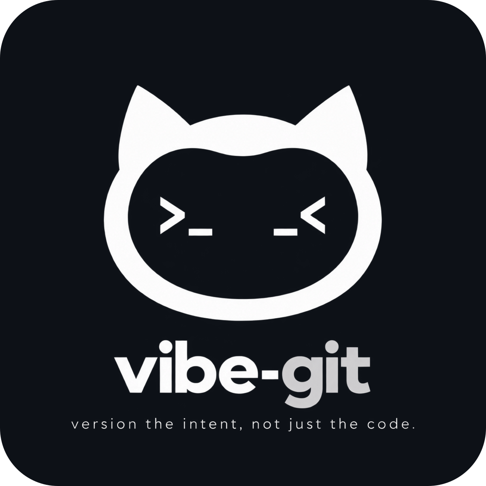

<p align="center"></p>

<h1 align="center">Vibe-Git</h1>
<p align="center"><strong>One repo. Many agents. One intent.</strong><br />给多人 Codex 开发一条可追踪的协作协议。</p>

<p align="center"><code>CLI-first</code> · <code>Captain-hosted</code> · <code>Git + Codex</code> · <code>v0.20</code></p>

<p align="center"><a href="https://tfboy1.github.io/vibe-git/">文档站</a> · <a href="#快速开始">快速开始</a> · <a href="vibe-git/README.md">使用手册</a> · <a href="vibe-git/CHANGELOG.md">更新日志</a> · <a href="https://github.com/TFboy1/vibe-git/issues">Issues</a></p>

---

## Git 记录代码，Vibe-Git 记录团队决定

多个 Codex 可以同时写出正确的代码，却可能各自实现了不同的需求。Git 擅长保存分支、提交和 diff；它不会自动告诉团队哪份提案已获确认、冲突由谁裁决、任务按哪个版本开工。

Vibe-Git 在现有 Git 工作区之上管理**提案 → 对齐 → 任务 → 变更审核**。队长托管协作房间，成员在自己的机器上使用 Codex 和 Git。代码仍由 Git 管理，团队决议有了明确的版本和状态。

| 团队需要知道 | Git 中可见 | Vibe-Git 增加 |
| --- | --- | --- |
| 要做什么 | 需求文件的修改历史 | 每位成员的当前提案、冻结版本、对齐稿和待裁决问题 |
| 何时开工 | 分支与提交 | 队长发布任务，负责人显式启动自己的 Codex |
| 需求变了影响谁 | 代码 diff | 内部需求变更单、逐任务影响证据和队长确认 |
| 何时算完成 | 最终 commit | Codex 与 Git 状态同步，以及负责人的完成确认 |

## 快速开始

需要 **Node.js 24+、Git、Codex CLI**。先安装 Skill，再手动安装 CLI：

```powershell
npx skills add TFboy1/vibe-git-skill --skill vibe-git
npm install -g @vibe-git/vibe-git
vibe-git --help
```

也可以从源码构建 CLI，构建入口在仓库的 `vibe-git/` 子目录：

```powershell
git clone --recurse-submodules https://github.com/TFboy1/vibe-git.git
cd vibe-git/vibe-git
npm ci
npm run build
npm link
```

队长进入**自己的项目 Git 工作区**，启动房间并复制命令输出中的成员加入链接：

```powershell
vibe-git host start
vibe-git open
```

成员进入**各自的项目 Git 工作区**，运行队长给出的加入命令，然后提交一份 UTF-8 Markdown 提案：

```powershell
vibe-git connect "https://xxxx.trycloudflare.com/join/xxxxx"
vibe-git plan submit .\proposal.md
```

对齐与审核前，可在各节点运行 `vibe-git codex bind`，绑定独立的 Codex 审核池。队长随后使用 `vibe-git align start` 开始对齐；裁决、指派与发布命令见[完整使用手册](vibe-git/README.md)。加入链接含注册密钥，只交给预期成员。

## 工作流

| 阶段 | 操作 | 保留下来的结果 |
| --- | --- | --- |
| **PLAN** | 成员 `plan submit <文件.md>` | 每人一份当前提案；更新形成新版本，团队可查看 |
| **ALIGN** | 队长 `align start`，裁决后 `tasks publish` | 冻结的提案集合、对齐稿、冲突选择与任务 |
| **BUILD** | 负责人 `task pull`、`task start`、`task sync`、`task done` | 明确的开工动作、Git/Codex 状态与完成确认 |
| **CHANGE** | 成员 `pr submit`，队长 `review apply` 或 `review reject` | 需求变更、影响证据和应用决定 |

任务发布不会自动启动所有 Codex；Codex 结束也不会自动把任务标为完成。`pr submit` 创建的是 **Vibe-Git 内部需求变更单**，不会创建 GitHub Pull Request。

## 运行方式

```text
队长电脑：Git 工作区 + Codex + Vibe-Git CLI
                         │
                         └── Host + SQLite + Web 房间
                                        ▲
                            Cloudflare Quick Tunnel
                                        │
成员电脑：各自的 Git 工作区 + Codex + Vibe-Git CLI
```

每位成员保留自己的 Git 工作区和日常 Codex 配置。专用审核池的凭据保存在各节点本机；Host 接收协作状态和受限证据，不接收成员的日常 Codex 凭据、完整聊天正文或工具记录。网页集中展示提案、对齐、任务和审核状态，并支持部分提案与排期操作。

## 文档与当前状态

- [使用手册](vibe-git/README.md)：完整 CLI 命令、队长与成员流程、数据边界。
- [Codex Skill](https://github.com/TFboy1/vibe-git-skill)：独立发布、可通过 `npx skills add TFboy1/vibe-git-skill --skill vibe-git` 安装；主项目中的 `.agents/skills/vibe-git` 以 Git submodule 绑定。
- [更新日志](vibe-git/CHANGELOG.md)：0.20 的界面、提案和排期更新。
- [Issues](https://github.com/TFboy1/vibe-git/issues)：反馈问题与使用体验。

当前版本为 **0.20**。Cloudflare Quick Tunnel 使用临时地址；真实跨设备房间和公网 Host 仍需在目标环境联调。仓库根目录保留的 [AgentGit M0 交接](M0-HANDOFF.md)与[验证记录](M0-VALIDATION.md)属于历史快照，不是当前版本的安装步骤。
